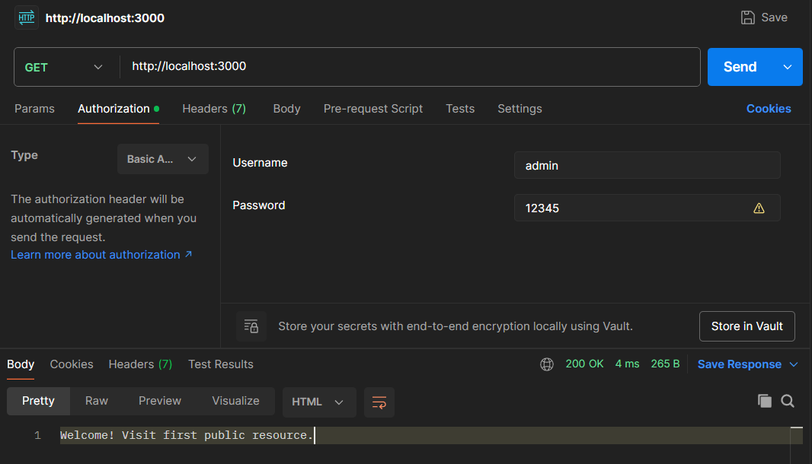
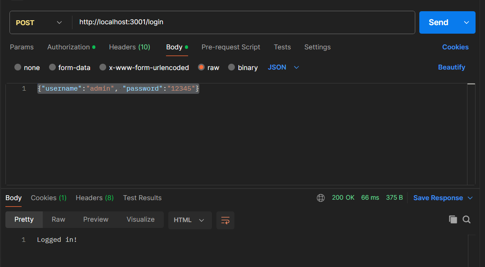
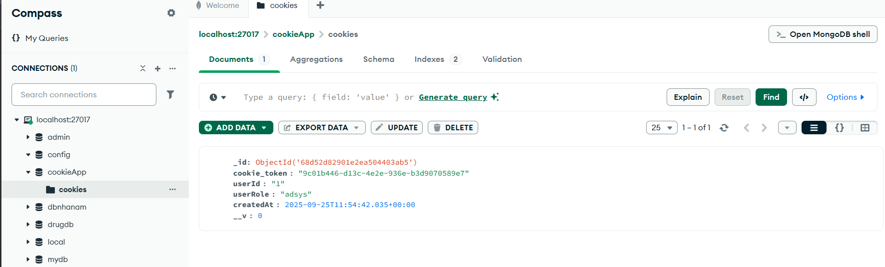

npm install express

1. simple_auth source code

a.node basic_auth.js

GET http://localhost:3000

Authorization -> Type : Basic Auth

Username: admin

Password: 12345

2.node cookie_auth.js

POST http://localhost:3001/login
Body -> raw
{"username":"admin", "password":"12345"}

Show cookie in mongoDB

